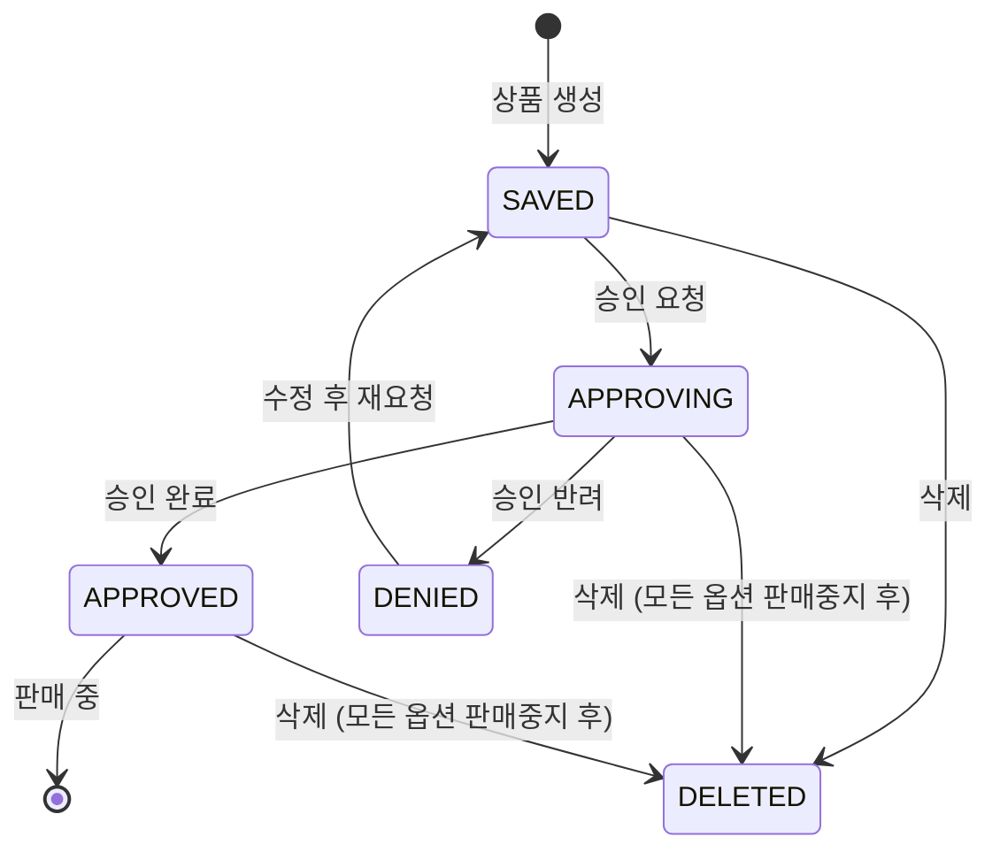

# 쿠팡 상품 상태 매핑 가이드

이 문서는 쿠팡 상품 상태와 상태 전환 로직을 설명합니다.

## 목차

1. [상품 상태 목록](#상품-상태-목록)
2. [상태 전환 로직](#상태-전환-로직)
3. [상태별 가능한 작업](#상태별-가능한-작업)
4. [상태 동기화](#상태-동기화)

---

## 상품 상태 목록

### 쿠팡 API 상태값

| 상태값 (API) | 상태명 (한글) | 설명 |
|-------------|-------------|------|
| `IN_REVIEW` | 심사중 | 상품이 심사 중인 상태 |
| `SAVED` | 임시저장 | 임시 저장된 상태 |
| `APPROVING` | 승인대기중 | 승인 요청 후 대기 중인 상태 |
| `APPROVED` | 승인완료 | 승인 완료되어 판매 가능한 상태 |
| `PARTIAL_APPROVED` | 부분승인완료 | 일부 옵션만 승인된 상태 |
| `DENIED` | 승인반려 | 승인이 반려된 상태 |
| `DELETED` | 상품삭제 | 삭제된 상품 |

### 내부 상태 매핑

```python
# app/coupang_sync.py에서 사용하는 상태 매핑
COUPANG_STATUS_MAPPING = {
    "IN_REVIEW": "심사중",
    "SAVED": "임시저장",
    "APPROVING": "승인대기중",
    "APPROVED": "승인완료",
    "PARTIAL_APPROVED": "부분승인완료",
    "DENIED": "승인반려",
    "DELETED": "상품삭제",
}
```

---

## 상태 전환 로직

### 상태 전환 다이어그램



### 상태 전환 규칙

1. **임시저장 → 승인대기중**
   - `requested=True`로 상품 생성 또는 수정
   - 또는 `approve_product()` API 호출

2. **승인대기중 → 승인완료**
   - 쿠팡 심사 완료 (자동)
   - API로 직접 제어 불가

3. **승인대기중 → 승인반려**
   - 쿠팡 심사 실패 (자동)
   - API로 직접 제어 불가

4. **승인반려 → 임시저장**
   - 상품 정보 수정 후 재요청

5. **임시저장/승인완료 → 상품삭제**
   - 모든 옵션 판매중지 후 삭제 가능

---

## 상태별 가능한 작업

### 임시저장 (SAVED)

**가능한 작업:**
- ✅ 상품 정보 수정 (`update_product()`)
- ✅ 상품 삭제 (`delete_product()`)
- ✅ 승인 요청 (`approve_product()`)
- ❌ 가격/재고 수정 (별도 API 사용 불가, 승인 완료 후 가능)

**사용 예시:**
```python
# 상품 정보 수정
code, data = client.update_product(payload)

# 승인 요청
code, data = client.approve_product(seller_product_id)
```

### 승인대기중 (APPROVING)

**가능한 작업:**
- ✅ 상품 정보 수정 (`update_product()`)
- ✅ 상품 삭제 (`delete_product()`) - 모든 옵션 판매중지 후
- ❌ 가격/재고 수정 (별도 API 사용 불가)
- ❌ 배송/반품지 정보 수정 (`update_product_partial()` 불가)

**사용 예시:**
```python
# 상품 정보 수정 (승인 대기 중에도 가능)
code, data = client.update_product(payload)

# 삭제 (모든 옵션 판매중지 후)
# delete_product_from_coupang()에서 자동 처리됨
```

### 승인완료 (APPROVED)

**가능한 작업:**
- ✅ 가격 수정 (`update_price()`)
- ✅ 재고 수정 (`update_stock()`)
- ✅ 할인율 기준가격 수정 (`update_original_price()`)
- ✅ 판매 상태 변경 (`stop_sales()`, `resume_sales()`)
- ✅ 배송/반품지 정보 수정 (`update_product_partial()`)
- ✅ 상품 정보 수정 (`update_product()`) - 승인 필요
- ✅ 상품 삭제 (`delete_product()`) - 모든 옵션 판매중지 후

**사용 예시:**
```python
# 가격 수정 (즉시 반영)
code, data = client.update_price(vendor_item_id, new_price)

# 재고 수정 (즉시 반영)
code, data = client.update_stock(vendor_item_id, new_quantity)

# 배송비 수정 (즉시 반영, 승인 불필요)
from app.coupang_sync import update_product_delivery_info
success, error = update_product_delivery_info(
    session, account_id, product_id,
    delivery_charge=3000
)
```

### 승인반려 (DENIED)

**가능한 작업:**
- ✅ 상품 정보 수정 (`update_product()`)
- ✅ 승인 요청 (`approve_product()`)
- ❌ 가격/재고 수정 (별도 API 사용 불가)

**사용 예시:**
```python
# 반려 사유 확인
code, data = client.get_product_status_history(seller_product_id)
histories = data.get("data", [])

for history in histories:
    if history.get("status") == "승인반려":
        print(f"반려 사유: {history.get('comment')}")

# 상품 정보 수정 후 재요청
code, data = client.update_product(payload)
```

### 상품삭제 (DELETED)

**가능한 작업:**
- ❌ 모든 작업 불가

---

## 상태 동기화

### 상태 동기화 프로세스

```python
# app/coupang_sync.py의 sync_market_listing_status() 함수 사용

from app.coupang_sync import sync_market_listing_status

# 상품 상태 동기화
success, error = sync_market_listing_status(session, listing_id)

if success:
    print("상태 동기화 성공")
else:
    print(f"상태 동기화 실패: {error}")
```

### 상태 동기화 로직

1. **쿠팡 API에서 상품 상태 조회**
   ```python
   code, data = client.get_product(seller_product_id)
   status_name = data["data"].get("statusName", "")
   ```

2. **내부 DB 상태 업데이트**
   ```python
   listing.coupang_status = status_name
   session.commit()
   ```

3. **상태 변경 이력 저장**
   ```python
   # 상태 변경 이력 조회
   code, data = client.get_product_status_history(seller_product_id)
   histories = data.get("data", [])
   ```

### 자동 상태 감지

```python
# 주기적 상태 확인 (예: 10분마다)
import asyncio
import time

async def auto_sync_status():
    while True:
        # 모든 등록된 상품 상태 동기화
        listings = session.query(MarketListing).all()
        for listing in listings:
            sync_market_listing_status(session, listing.id)
        
        await asyncio.sleep(600)  # 10분 대기
```

---

## 상태별 권장 작업

### 상품 등록 후

1. **임시저장 상태 확인**
   ```python
   code, data = client.get_product(seller_product_id)
   status = data["data"].get("statusName", "")
   
   if status == "임시저장":
       # 승인 요청
       client.approve_product(seller_product_id)
   ```

2. **승인 완료 대기**
   ```python
   # 상태 이력 확인
   code, data = client.get_product_status_history(seller_product_id)
   histories = data.get("data", [])
   
   for history in histories:
       if history.get("status") == "승인완료":
           print("승인 완료됨")
           break
   ```

### 승인 반려 시

1. **반려 사유 확인**
   ```python
   code, data = client.get_product_status_history(seller_product_id)
   histories = data.get("data", [])
   
   for history in histories:
       if history.get("status") == "승인반려":
           comment = history.get("comment", "")
           print(f"반려 사유: {comment}")
   ```

2. **상품 정보 수정 후 재요청**
   ```python
   # 상품 정보 수정
   code, data = client.update_product(payload)
   
   # 승인 요청
   code, data = client.approve_product(seller_product_id)
   ```

### 승인 완료 후

1. **가격/재고 동기화**
   ```python
   # 가격 수정
   client.update_price(vendor_item_id, new_price)
   
   # 재고 수정
   client.update_stock(vendor_item_id, new_quantity)
   ```

2. **배송/반품지 정보 수정**
   ```python
   from app.coupang_sync import update_product_delivery_info
   
   update_product_delivery_info(
       session, account_id, product_id,
       delivery_charge=3000,
       delivery_charge_type="CONDITIONAL_FREE"
   )
   ```

---

## 참고 자료

- [쿠팡 API 사용 가이드](COUPANG_API_GUIDE.md)
- [쿠팡 API 에러 처리 가이드](COUPANG_API_ERRORS.md)
