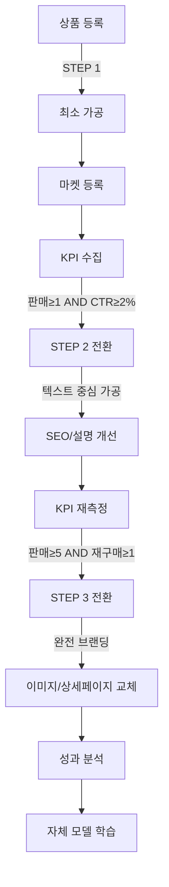

# 드랍쉬핑 3단계 전략 - 데이터베이스 설계

## 1. 개요

이 문서는 드랍쉬핑 3단계 전략(탐색 → 검증 → 스케일)을 구현하기 위한 데이터베이스 설계입니다.

## 2. 핵심 전략 요약

| 단계 | 목표 | AI 사용 수준 | 가공 범위 | 전환 조건 |
|------|------|-------------|-----------|-----------|
| STEP 1 | 대량 상품 등록, 데이터 수집 | 최소 (경량 텍스트/키워드) | 상품명만 최소 가공 | 판매 ≥ 1 AND CTR ≥ X% |
| STEP 2 | 검증된 상품 집중 가공 | 중간 (qwen3:8b 텍스트/SEO) | 상품명·옵션·상세 설명 개선 | 판매 ≥ 5 AND 재구매/옵션 확장 가능성 |
| STEP 3 | 검증된 상품 완전 브랜딩 | 최대 (qwen3-vl:8b + 외부 API) | 이미지·상세페이지 완전 교체 | LTV 대비 비용 상한 |

## 3. 데이터베이스 변경사항

### 3.1 Product 테이블 확장

```python
class Product(DropshipBase):
    __tablename__ = "products"

    # 기존 필드...
    id: Mapped[uuid.UUID] = mapped_column(UUID(as_uuid=True), primary_key=True, default=uuid.uuid4)
    name: Mapped[str] = mapped_column(Text, nullable=False)
    # ...

    # === 3단계 전략 관련 필드 추가 ===
    
    # 라이프사이클 단계
    lifecycle_stage: Mapped[str] = mapped_column(
        Text, 
        nullable=False, 
        default="STEP_1",
        comment="STEP_1: 탐색, STEP_2: 검증, STEP_3: 스케일"
    )
    lifecycle_stage_updated_at: Mapped[datetime] = mapped_column(
        DateTime(timezone=True),
        nullable=True,
        comment="단계 변경 시점"
    )
    
    # KPI 지표 (STEP 1 → 2 전환용)
    total_sales_count: Mapped[int] = mapped_column(
        Integer,
        nullable=False,
        default=0,
        comment="총 판매 횟수"
    )
    total_views: Mapped[int] = mapped_column(
        Integer,
        nullable=False,
        default=0,
        comment="총 조회수"
    )
    total_clicks: Mapped[int] = mapped_column(
        Integer,
        nullable=False,
        default=0,
        comment="총 클릭수"
    )
    ctr: Mapped[float] = mapped_column(
        Float,
        nullable=False,
        default=0.0,
        comment="클릭률 (clicks / views)"
    )
    conversion_rate: Mapped[float] = mapped_column(
        Float,
        nullable=False,
        default=0.0,
        comment="전환율 (sales / clicks)"
    )
    
    # 재구매/옵션 확장 지표 (STEP 2 → 3 전환용)
    repeat_purchase_count: Mapped[int] = mapped_column(
        Integer,
        nullable=False,
        default=0,
        comment="재구매 횟수"
    )
    option_expansion_count: Mapped[int] = mapped_column(
        Integer,
        nullable=False,
        default=0,
        comment="옵션 확장 횟수"
    )
    customer_retention_rate: Mapped[float] = mapped_column(
        Float,
        nullable=False,
        default=0.0,
        comment="고객 유지율"
    )
    
    # LTV (Lifetime Value) - STEP 3 진입 기준
    total_revenue: Mapped[int] = mapped_column(
        Integer,
        nullable=False,
        default=0,
        comment="총 매출"
    )
    avg_customer_value: Mapped[float] = mapped_column(
        Float,
        nullable=False,
        default=0.0,
        comment="고객당 평균 가치"
    )
    
    # 가공 이력 관련
    last_processing_type: Mapped[str] = mapped_column(
        Text,
        nullable=True,
        comment="마지막 가공 유형 (NAME, OPTION, DESCRIPTION, IMAGE, DETAIL_PAGE)"
    )
    last_processing_at: Mapped[datetime] = mapped_column(
        DateTime(timezone=True),
        nullable=True,
        comment="마지막 가공 시점"
    )
    
    # AI 모델 사용 이력
    ai_model_used: Mapped[str] = mapped_column(
        Text,
        nullable=True,
        comment="사용된 AI 모델 (qwen3:8b, qwen3-vl:8b, etc.)"
    )
```

### 3.2 ProductLifecycle 테이블 (새로 추가)

```python
class ProductLifecycle(DropshipBase):
    """
    상품 라이프사이클 단계 변경 이력을 추적합니다.
    """
    __tablename__ = "product_lifecycles"
    __table_args__ = (
        UniqueConstraint("product_id", "transition_sequence", name="uq_product_lifecycles_product_seq"),
    )

    id: Mapped[uuid.UUID] = mapped_column(UUID(as_uuid=True), primary_key=True, default=uuid.uuid4)
    product_id: Mapped[uuid.UUID] = mapped_column(
        UUID(as_uuid=True),
        ForeignKey("products.id"),
        nullable=False
    )
    
    # 단계 전환 정보
    transition_sequence: Mapped[int] = mapped_column(
        Integer,
        nullable=False,
        default=1,
        comment="전환 순서 (1, 2, 3...)"
    )
    from_stage: Mapped[str] = mapped_column(
        Text,
        nullable=True,
        comment="이전 단계 (STEP_1, STEP_2, STEP_3)"
    )
    to_stage: Mapped[str] = mapped_column(
        Text,
        nullable=False,
        comment="새 단계 (STEP_1, STEP_2, STEP_3)"
    )
    
    # 전환 기준 KPI
    kpi_snapshot: Mapped[dict] = mapped_column(
        JSONB,
        nullable=False,
        default=dict,
        comment="전환 시점의 KPI 스냅샷"
    )
    
    # 전환 사유
    transition_reason: Mapped[str] = mapped_column(
        Text,
        nullable=True,
        comment="단계 전환 사유"
    )
    auto_transition: Mapped[bool] = mapped_column(
        default=False,
        comment="자동 전환 여부"
    )
    
    # 메타데이터
    created_at: Mapped[datetime] = mapped_column(
        DateTime(timezone=True),
        server_default=func.now()
    )
```

### 3.3 ProcessingHistory 테이블 (새로 추가)

```python
class ProcessingHistory(DropshipBase):
    """
    상품 가공 이력을 추적합니다.
    가공 전/후의 성과 변화를 분석하여 자체 드랍쉬핑 모델을 구축합니다.
    """
    __tablename__ = "processing_histories"

    id: Mapped[uuid.UUID] = mapped_column(UUID(as_uuid=True), primary_key=True, default=uuid.uuid4)
    product_id: Mapped[uuid.UUID] = mapped_column(
        UUID(as_uuid=True),
        ForeignKey("products.id"),
        nullable=False
    )
    
    # 가공 정보
    processing_type: Mapped[str] = mapped_column(
        Text,
        nullable=False,
        comment="가공 유형 (NAME, OPTION, DESCRIPTION, IMAGE, DETAIL_PAGE, FULL_BRANDING)"
    )
    processing_stage: Mapped[str] = mapped_column(
        Text,
        nullable=False,
        comment="가공 시점의 단계 (STEP_1, STEP_2, STEP_3)"
    )
    
    # 가공 전 데이터
    before_data: Mapped[dict] = mapped_column(
        JSONB,
        nullable=False,
        default=dict,
        comment="가공 전 상태 (name, description, image_urls, etc.)"
    )
    before_kpi: Mapped[dict] = mapped_column(
        JSONB,
        nullable=False,
        default=dict,
        comment="가공 전 KPI (ctr, conversion_rate, etc.)"
    )
    
    # 가공 후 데이터
    after_data: Mapped[dict] = mapped_column(
        JSONB,
        nullable=False,
        default=dict,
        comment="가공 후 상태"
    )
    after_kpi: Mapped[dict] = mapped_column(
        JSONB,
        nullable=True,
        comment="가공 후 KPI (일정 기간 후 업데이트)"
    )
    
    # AI 처리 정보
    ai_model: Mapped[str] = mapped_column(
        Text,
        nullable=True,
        comment="사용된 AI 모델"
    )
    ai_processing_time_ms: Mapped[int] = mapped_column(
        Integer,
        nullable=True,
        comment="AI 처리 시간 (ms)"
    )
    ai_cost_estimate: Mapped[float] = mapped_column(
        Float,
        nullable=True,
        comment="추정 AI 처리 비용"
    )
    
    # 성과 분석
    kpi_improvement: Mapped[dict] = mapped_column(
        JSONB,
        nullable=True,
        comment="KPI 개선율 (ctr_change, conversion_change, etc.)"
    )
    roi_score: Mapped[float] = mapped_column(
        Float,
        nullable=True,
        comment="ROI 점수 (0-100)"
    )
    
    # 메타데이터
    processed_at: Mapped[datetime] = mapped_column(
        DateTime(timezone=True),
        server_default=func.now()
    )
    kpi_measured_at: Mapped[datetime] = mapped_column(
        DateTime(timezone=True),
        nullable=True,
        comment="가공 후 KPI 측정 시점"
    )
```

### 3.4 MarketListing 테이블 확장

```python
class MarketListing(MarketBase):
    __tablename__ = "market_listings"

    # 기존 필드...
    id: Mapped[uuid.UUID] = mapped_column(UUID(as_uuid=True), primary_key=True, default=uuid.uuid4)
    product_id: Mapped[uuid.UUID] = mapped_column(UUID(as_uuid=True), nullable=False)
    # ...

    # === 3단계 전략 관련 필드 추가 ===
    
    # 노출/클릭 지표
    view_count: Mapped[int] = mapped_column(
        Integer,
        nullable=False,
        default=0,
        comment="노출수"
    )
    click_count: Mapped[int] = mapped_column(
        Integer,
        nullable=False,
        default=0,
        comment="클릭수"
    )
    
    # 시장별 KPI 업데이트 시점
    kpi_updated_at: Mapped[datetime] = mapped_column(
        DateTime(timezone=True),
        nullable=True,
        comment="KPI 마지막 업데이트 시점"
    )
```

## 4. 단계 전환 로직

### 4.1 STEP 1 → 2 전환 조건

```python
STEP_1_TO_2_CRITERIA = {
    "min_sales": 1,           # 최소 판매 횟수
    "min_ctr": 0.02,          # 최소 CTR (2%)
    "min_views": 100,         # 최소 노출수
    "min_days_listed": 7,     # 최소 등록 일수
}
```

### 4.2 STEP 2 → 3 전환 조건

```python
STEP_2_TO_3_CRITERIA = {
    "min_sales": 5,                    # 최소 판매 횟수
    "min_repeat_purchase": 1,          # 최소 재구매 횟수
    "min_customer_retention": 0.1,     # 최소 고객 유지율 (10%)
    "min_revenue": 100000,             # 최소 총 매출 (원)
    "min_days_in_step2": 14,           # STEP 2 최소 체류 일수
}
```

## 5. Alembic 마이그레이션

```bash
alembic revision --autogenerate -m "add_product_lifecycle_strategy"
alembic upgrade head
```

## 6. 서비스 레이어 변경사항

### 6.1 ProductLifecycleService (새로 추가)

```python
class ProductLifecycleService:
    """
    상품 라이프사이클 단계 관리 서비스
    """
    
    async def check_stage_transition(self, product_id: uuid.UUID) -> bool:
        """단계 전환 조건 확인"""
        
    async def transition_to_step2(self, product_id: uuid.UUID, reason: str) -> ProductLifecycle:
        """STEP 1 → 2 전환"""
        
    async def transition_to_step3(self, product_id: uuid.UUID, reason: str) -> ProductLifecycle:
        """STEP 2 → 3 전환"""
        
    async def get_lifecycle_history(self, product_id: uuid.UUID) -> list[ProductLifecycle]:
        """라이프사이클 이력 조회"""
```

### 6.2 ProcessingHistoryService (새로 추가)

```python
class ProcessingHistoryService:
    """
    상품 가공 이력 관리 서비스
    """
    
    async def record_processing(
        self,
        product_id: uuid.UUID,
        processing_type: str,
        before_data: dict,
        after_data: dict,
        ai_model: str
    ) -> ProcessingHistory:
        """가공 이력 기록"""
        
    async def measure_processing_impact(
        self,
        processing_history_id: uuid.UUID,
        days_after: int = 7
    ) -> dict:
        """가공 영향 측정 (가공 후 N일간의 KPI 변화)"""
        
    async def get_best_practices(self, processing_type: str) -> list[dict]:
        """최적 가공 방법 추천"""
```

## 7. AI 모델 사용 전략

| 단계 | 작업 유형 | 모델 | 목적 |
|------|----------|------|------|
| STEP 1 | 키워드 추출 | qwen3:8b | 검색 노출 최적화 |
| STEP 1 | 상품명 최소 가공 | qwen3:8b | 기본 정보 정리 |
| STEP 2 | SEO 최적화 | qwen3:8b | 검색 순위 상승 |
| STEP 2 | 상세 설명 개선 | qwen3:8b | 고객 이해도 향상 |
| STEP 2 | 옵션명 개선 | qwen3:8b | 구매 전환율 상승 |
| STEP 3 | 이미지 분석 | qwen3-vl:8b | 경쟁사 대비 차별화 |
| STEP 3 | 상세페이지 생성 | qwen3-vl:8b + 외부 API | 브랜드 수준 가공 |
| STEP 3 | USP 추출 | qwen3:8b + qwen3-vl:8b | 고유 판매 포인트 명확화 |

## 8. 예시 워크플로



## 9. KPI 대시보드

### 9.1 단계별 상품 분포
- STEP 1: 상품 수, 평균 CTR, 평균 전환율
- STEP 2: 상품 수, 평균 판매 횟수, 평균 ROI
- STEP 3: 상품 수, 총 매출, 평균 LTV

### 9.2 전환율 분석
- STEP 1 → 2 전환율 (전환된 상품 / STEP 1 총 상품)
- STEP 2 → 3 전환율
- 전환 실패 사유 분석

### 9.3 가공 ROI 분석
- 가공 유형별 ROI 점수
- AI 모델별 비용 대비 효과
- 최적 가공 타이밍

## 10. 다음 단계

1. Alembic 마이그레이션 생성 및 실행
2. ProductLifecycleService 구현
3. ProcessingHistoryService 구현
4. 자동 단계 전환 스케줄러 구현
5. KPI 수집 및 업데이트 API 구현
6. 대시보드 UI 구현
