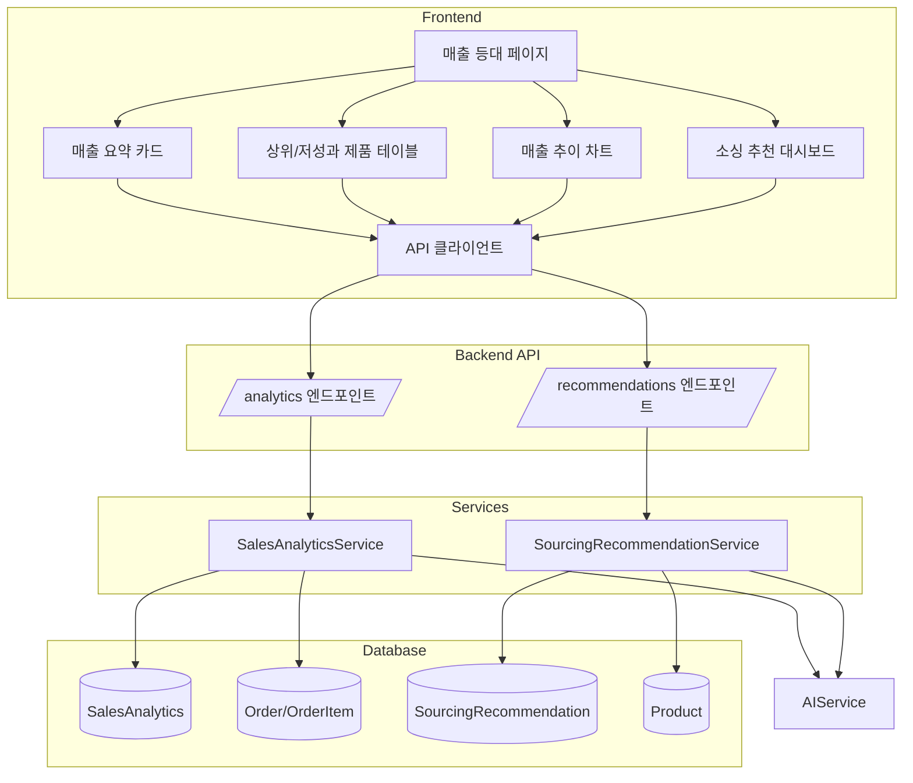

# 매출 등대 통합 대시보드 설계 계획

## 1. 개요

매출 등대는 드랍쉬핑 자동화 시스템의 매출 데이터, AI 예측, 소싱 추천을 통합하여 시각화하는 대시보드입니다. 기존 백엔드 API([`SalesAnalyticsService`](app/services/sales_analytics_service.py), [`SourcingRecommendationService`](app/services/sourcing_recommendation_service.py))를 활용하여 실시간 매출 분석 및 예측을 제공합니다.

## 2. 아키텍처 개요



## 3. 페이지 구조

### 3.1 메인 레이아웃

```
┌─────────────────────────────────────────────────────────────┐
│  매출 등대                                    [새로고침]      │
├─────────────────────────────────────────────────────────────┤
│  [매출 요약 카드 4개]                                        │
│  ┌──────────┐ ┌──────────┐ ┌──────────┐ ┌──────────┐      │
│  │ 총 매출  │ │ 주문 수  │ │ 총 이익  │ │ 성장률   │      │
│  └──────────┘ └──────────┘ └──────────┘ └──────────┘      │
├─────────────────────────────────────────────────────────────┤
│  [매출 추이 차트]                                           │
│  ┌──────────────────────────────────────────────────────┐ │
│  │  주간/월간 매출 추이 (라인 차트)                      │ │
│  └──────────────────────────────────────────────────────┘ │
├─────────────────────────────────────────────────────────────┤
│  [상위 성과 제품]           [저성과 제품]                   │
│  ┌─────────────────────┐   ┌─────────────────────┐       │
│  │ 제품 테이블 (TOP 10)│   │ 제품 테이블 (LOW 10) │       │
│  └─────────────────────┘   └─────────────────────┘       │
├─────────────────────────────────────────────────────────────┤
│  [소싱 추천 대시보드]                                       │
│  ┌──────────────────────────────────────────────────────┐ │
│  │ 대기 중 추천 목록 | 재고 부족 알림 | 추천 요약         │ │
│  └──────────────────────────────────────────────────────┘ │
└─────────────────────────────────────────────────────────────┘
```

## 4. 컴포넌트 상세 설계

### 4.1 매출 요약 카드 (SalesSummaryCards)

**위치:** `frontend/src/components/analytics/SalesSummaryCards.tsx`

| 카드 | 데이터 소스 | API 엔드포인트 |
|------|------------|----------------|
| 총 매출 | `total_revenue` 집계 | `/analytics/summary` |
| 총 주문 | `total_orders` 집계 | `/analytics/summary` |
| 총 이익 | `total_profit` 집계 | `/analytics/summary` |
| 성장률 | `revenue_growth_rate` 평균 | `/analytics/summary` |

### 4.2 상위/저성과 제품 테이블 (ProductPerformanceTable)

**위치:** `frontend/src/components/analytics/ProductPerformanceTable.tsx`

**API 엔드포인트:**
- 상위 성과: `/analytics/top-performing?limit=10&period_type=weekly`
- 저성과: `/analytics/low-performing?limit=10&period_type=weekly`

**표시 컬럼:**
- 제품명
- 주문 수
- 매출액
- 이익률
- 성장률
- 예측 매출

### 4.3 매출 추이 차트 (SalesTrendChart)

**위치:** `frontend/src/components/analytics/SalesTrendChart.tsx`

**기능:**
- 주간/월간 전환
- 실제 매출 vs 예측 매출 비교
- 차트 라이브러리: Recharts

**API 엔드포인트:**
- `/analytics/trend?period_type=weekly&periods=12`

### 4.4 소싱 추천 대시보드 (SourcingRecommendationDashboard)

**위치:** `frontend/src/components/analytics/SourcingRecommendationDashboard.tsx`

**서브 섹션:**
1. **대기 중 추천 목록**
   - API: `/recommendations/pending?limit=10`
   - 표시: 제품명, 추천 점수, 추천 수량, 예상 이익

2. **재고 부족 알림**
   - API: `/recommendations/reorder-alerts`
   - 표시: 제품명, 남은 재고 일수, 추천 수량

3. **추천 요약**
   - API: `/recommendations/summary?days=7`
   - 표시: 총 추천 수, 수락률, 평균 점수

## 5. API 클라이언트 확장

**위치:** `frontend/src/lib/analytics-api.ts`

```typescript
// 매출 분석 API
export const analyticsAPI = {
  getSummary: () => api.get('/analytics/summary'),
  getTopPerforming: (params) => api.get('/analytics/top-performing', { params }),
  getLowPerforming: (params) => api.get('/analytics/low-performing', { params }),
  getTrend: (params) => api.get('/analytics/trend', { params }),
  getProductAnalytics: (productId, params) => api.get(`/analytics/product/${productId}`, { params }),
  triggerBulkAnalyze: (params) => api.post('/analytics/bulk-analyze', null, { params }),
}

// 소싱 추천 API
export const recommendationsAPI = {
  generate: (payload) => api.post('/recommendations/generate', payload),
  getPending: (params) => api.get('/recommendations/pending', { params }),
  getRecommendation: (id) => api.get(`/recommendations/${id}`),
  getProductRecommendations: (productId, params) => api.get(`/recommendations/product/${productId}`, { params }),
  acceptRecommendation: (id, payload) => api.patch(`/recommendations/${id}/accept`, payload),
  rejectRecommendation: (id, payload) => api.patch(`/recommendations/${id}/reject`, payload),
  getSummary: (params) => api.get('/recommendations/summary', { params }),
  getHighPriority: (params) => api.get('/recommendations/high-priority', { params }),
  getReorderAlerts: () => api.get('/recommendations/reorder-alerts'),
  triggerBulkGenerate: (params) => api.post('/recommendations/bulk-generate', null, { params }),
}
```

## 6. 타입 정의

**위치:** `frontend/src/lib/types/analytics.ts`

```typescript
// 매출 분석 타입
export interface SalesAnalytics {
  id: string;
  product_id: string;
  period_type: string;
  period_start: string;
  period_end: string;
  total_orders: number;
  total_quantity: number;
  total_revenue: number;
  total_profit: number;
  avg_margin_rate: number;
  order_growth_rate: number;
  revenue_growth_rate: number;
  predicted_orders?: number;
  predicted_revenue?: number;
  prediction_confidence?: number;
  category_trend_score: number;
  market_demand_score: number;
  trend_analysis?: string;
  insights?: string[];
  recommendations?: string[];
  created_at: string;
}

export interface ProductPerformance {
  product_id: string;
  product_name: string;
  total_orders: number;
  total_revenue: number;
  total_profit: number;
  avg_margin_rate: number;
  order_growth_rate: number;
  revenue_growth_rate: number;
  predicted_orders?: number;
  predicted_revenue?: number;
}

export interface SalesSummary {
  total_revenue: number;
  total_orders: number;
  total_profit: number;
  avg_growth_rate: number;
  period_type: string;
}

// 소싱 추천 타입
export interface SourcingRecommendation {
  id: string;
  product_id?: string;
  product_name?: string;
  recommendation_type: string;
  recommendation_date: string;
  overall_score: number;
  sales_potential_score: number;
  market_trend_score: number;
  profit_margin_score: number;
  supplier_reliability_score: number;
  seasonal_score: number;
  recommended_quantity: number;
  min_quantity: number;
  max_quantity: number;
  current_supply_price: number;
  recommended_selling_price: number;
  expected_margin: number;
  current_stock: number;
  stock_days_left?: number;
  reorder_point: number;
  reasoning?: string;
  risk_factors?: string[];
  opportunity_factors?: string[];
  status: string;
  confidence_level: number;
  created_at: string;
}

export interface RecommendationSummary {
  period_days: number;
  total_recommendations: number;
  pending: number;
  accepted: number;
  rejected: number;
  acceptance_rate: number;
  avg_overall_score: number;
}
```

## 7. 백엔드 API 라우터 등록

**위치:** `app/main.py`

기존 라우터에 추가:
```python
from app.api.endpoints import analytics, recommendations

app.include_router(analytics.router, prefix="/api/analytics", tags=["analytics"])
app.include_router(recommendations.router, prefix="/api/recommendations", tags=["recommendations"])
```

## 8. 사이드바 메뉴 추가

**위치:** `frontend/src/components/Sidebar.tsx`

Intelligence 그룹에 추가:
```typescript
{
    title: "Intelligence",
    items: [
        { name: "에이전트", href: "/agents", icon: Bot },
        { name: "매출 등대", href: "/analytics", icon: BarChart3 },
    ]
}
```

## 9. 구현 순서

1. **백엔드 API 라우터 등록** - [`main.py`](app/main.py)에 analytics 및 recommendations 라우터 추가
2. **타입 정의** - [`frontend/src/lib/types/analytics.ts`](frontend/src/lib/types/analytics.ts) 생성
3. **API 클라이언트 확장** - [`frontend/src/lib/analytics-api.ts`](frontend/src/lib/analytics-api.ts) 생성
4. **매출 요약 카드 컴포넌트** - [`frontend/src/components/analytics/SalesSummaryCards.tsx`](frontend/src/components/analytics/SalesSummaryCards.tsx) 생성
5. **상위/저성과 제품 테이블** - [`frontend/src/components/analytics/ProductPerformanceTable.tsx`](frontend/src/components/analytics/ProductPerformanceTable.tsx) 생성
6. **매출 추이 차트** - [`frontend/src/components/analytics/SalesTrendChart.tsx`](frontend/src/components/analytics/SalesTrendChart.tsx) 생성
7. **소싱 추천 대시보드** - [`frontend/src/components/analytics/SourcingRecommendationDashboard.tsx`](frontend/src/components/analytics/SourcingRecommendationDashboard.tsx) 생성
8. **매출 등대 메인 페이지** - [`frontend/src/app/analytics/page.tsx`](frontend/src/app/analytics/page.tsx) 생성
9. **사이드바 메뉴 추가** - [`Sidebar.tsx`](frontend/src/components/Sidebar.tsx) 수정
10. **테스트 및 검증**

## 10. 의존성

### 프론트엔드 추가 패키지
```json
{
  "recharts": "^2.10.0"
}
```

설치 명령:
```bash
cd frontend && npm install recharts
```

## 11. UI/UX 가이드라인

### 색상 팔레트
- 매출 증가: `emerald-500`
- 매출 감소: `red-500`
- 예측 데이터: `blue-500`
- 추천 점수 높음: `emerald-500`
- 추천 점수 중간: `amber-500`
- 추천 점수 낮음: `red-500`

### 애니메이션
- 카드 로딩: `framer-motion` fade-in
- 차트: Recharts 기본 애니메이션
- 테이블 로딩: skeleton UI

### 반응형 디자인
- 모바일: 카드 2열, 테이블 스크롤
- 태블릿: 카드 4열, 테이블 전체 표시
- 데스크톱: 전체 레이아웃

## 12. 백엔드 추가 API 엔드포인트

현재 구현된 엔드포인트 외에 추가가 필요한 경우:

| 엔드포인트 | 목적 | 상태 |
|-----------|------|------|
| `GET /analytics/summary` | 전체 매출 요약 | 필요 |
| `GET /analytics/trend` | 매출 추이 데이터 | 필요 |
